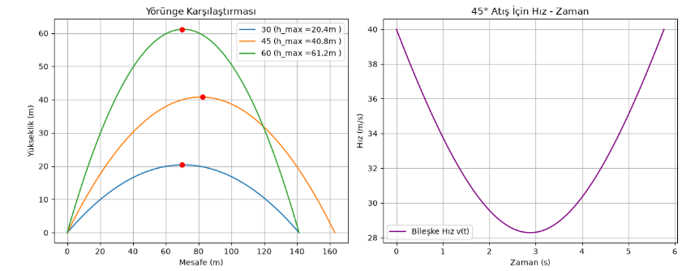
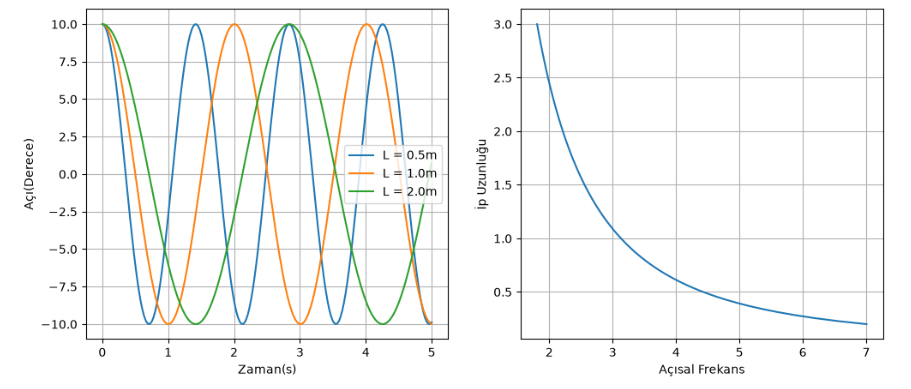
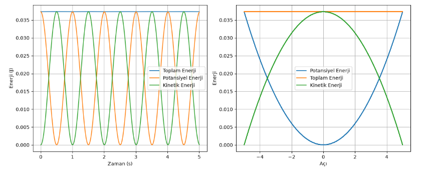

# Physics Simulations with Python

A collection of basic classical mechanics simulations written in Python using NumPy and Matplotlib.

## Projects

### 1. Projectile Motion (`01_Projectile_Motion`)

* Trajectory analysis across various launch angles and initial velocities.
* Decomposition of velocity components over time.

### 2. Simple Harmonic Motion: Pendulum Dynamics (`02_Simple_Pendulum`)

* Impact of pendulum length ($L$) on oscillation period and angular frequency ($\omega$).
* Dual-panel visualization (`subplot`) comparing angle-time series and length-frequency response.

### 3. Energy Conservation in Pendulums (`03_Energy_Conservation`)

* Time-series simulation of Potential ($E_p$), Kinetic ($E_k$), and Total ($E_{total}$) energy exchange.
* Phase-space energy analysis as a function of swing angle ($\theta$).
* **Note:** Numerical fluctuations in $E_{total}$ observed at initial amplitudes $\theta_{max} > 5^\circ$ due to the small-angle approximation limit (`v = -L * theta_max * omega * sin(omega * t)`).

## Tech Stack
* **Python 3.x**
* **NumPy:** Vectorized array operations and mathematical modeling.
* **Matplotlib:** Multi-panel visualization (`subplot`), layout adjustment, and custom plotting.

 ### 4. Free Fall with Drag & Sensor Noise (`04_Free_Fall_and_Sensor_Noise`)
- Solves non-linear ordinary differential equations (ODE) using `scipy.integrate.solve_ivp`.
- Incorporates quadratic air resistance ($dv/dt = -g + (k/m)v^2$).
- Generates synthetic Gaussian sensor noise using `numpy.random.normal` to simulate real-world measurements.
